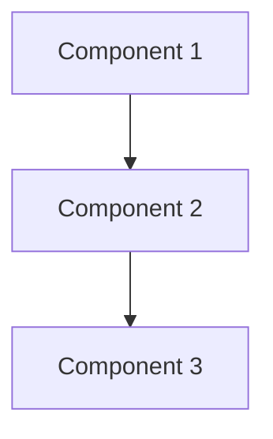
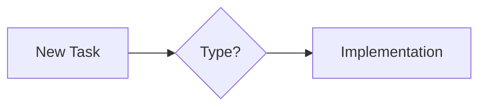

# Documentation Template

Use this prompt to organize any project's documentation:

```
Please organize this project's documentation following this structure:

1. Create a project_manifest.md that serves as the main entry point with:
   - System overview diagram (using mermaid)
   - 5 most important files/components
   - Essential commands
   - Quick reference for common tasks
   - Links to other docs

2. Create these core documents:
   - technical_guide.md (development & architecture)
   - quickstart.md (installation & setup)
   - roadmap.md (vision & planning)

3. Move all other docs to archive/ with SUMMARY.md tracking evolution

The goal is that new developers only need to read project_manifest.md to understand:
- Where key files are located
- How components interact
- Common tasks and commands
- When to reference other documents

Please maintain this structure using emojis for sections:
🎯 Overview
🔑 Key Components
🚀 Quick Start
📚 Documentation Map
🔄 Workflows
🎯 Quick Reference
```

## Document Templates

### project_manifest.md
```markdown
# 🎯 [Project Name]

## System Overview



## 🔑 Key Components & Entry Points

### Core Files
1. `path/to/key/file1`
   - Purpose
   - When to modify

[Additional key files...]

## 🚀 Essential Commands

```bash
# Start Development
command1

# Run Tests
command2

# Deploy
command3
```

## 📚 Documentation Map

### For New Users
1. [Quickstart Guide](quickstart.md)
   - What's covered

### For Developers
1. [Technical Guide](technical_guide.md)
   - What's covered

### For Project Managers
1. [Roadmap](roadmap.md)
   - What's covered

## 🔄 Development Workflow



## 🎯 Quick Reference

### Common Tasks
1. Task Name
   - Steps
   - Files involved
   - Commands needed
```

### technical_guide.md
```markdown
# 🛠️ Technical Guide

## System Architecture

### Core Components
[Detailed architecture diagram]

### Component Details
[Component-specific information]

## Development Workflow
[Development processes]

## API Reference
[API documentation]

## Deployment
[Deployment procedures]

## Monitoring & Debugging
[Monitoring information]
```

### quickstart.md
```markdown
# 🚀 Quickstart Guide

## Prerequisites
[Required software/setup]

## Installation Steps
[Step-by-step setup]

## Running the System
[How to run]

## Verification
[How to verify installation]

## Common Issues
[Troubleshooting]
```

### roadmap.md
```markdown
# 🗺️ Roadmap & Strategy

## Vision
[Project vision]

## Current Status
[Status overview]

## Upcoming Milestones
[Future plans]

## Implementation Strategy
[How we'll get there]

## Success Metrics
[How we measure success]
```

### archive/SUMMARY.md
```markdown
# 📚 Documentation Archive Summary

## Document Evolution
[Track document changes]

## Current Documentation Structure
[Map old docs to new]

## Legacy Access
[Why we keep archives]
```

## Usage

1. Create a docs/ folder in your project
2. Copy these templates
3. Customize for your project
4. Use the prompt when asking AI to organize documentation
5. Maintain the structure as the project evolves
