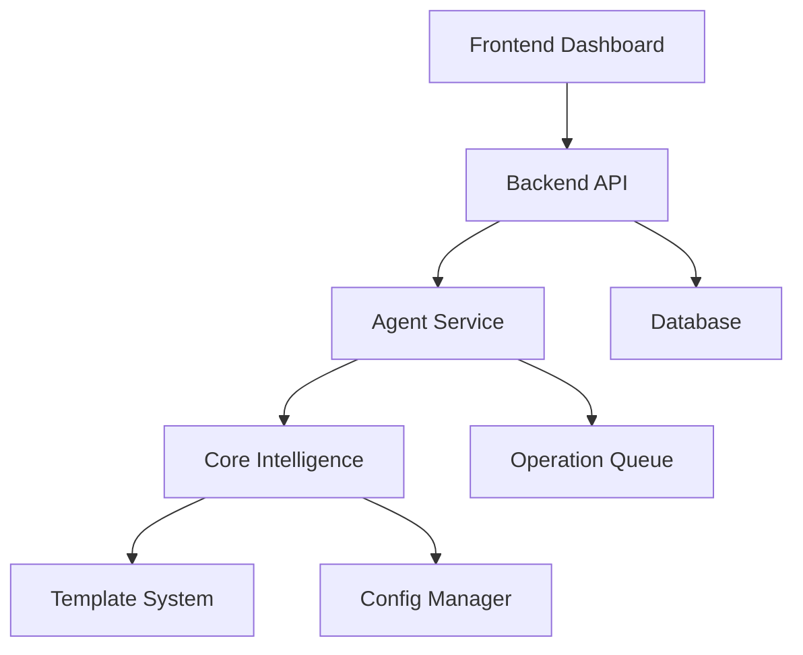

# 🎯 AI Staff Development Agent

## System Overview



## 🔑 Key Components & Entry Points

### Core Files
1. `backend/app/core/intelligence.py`
   - Core agent intelligence and capability management
   - Start here for understanding agent behavior

2. `backend/app/services/agent_service.py`
   - Agent lifecycle and operation handling
   - Key for agent-project interactions

3. `dashboard/frontend/src/components/Agents/AgentList.tsx`
   - Main agent management interface
   - Start here for UI modifications

4. `private/config/templates/agent_class.py.template`
   - Base template for agent generation
   - Reference for agent capabilities

5. `docker-compose.yml`
   - System deployment configuration
   - Service dependencies and networking

## 🚀 Essential Commands

```bash
# Start Development Environment
docker compose up -d
cd dashboard/frontend && npm run dev

# Run Tests
python -m pytest tests/

# Deploy Production
docker compose -f docker-compose.yml -f docker-compose.prod.yml up -d
```

## 📚 Documentation Map

### For New Users
1. [Quickstart Guide](quickstart.md)
   - Installation & basic setup
   - First-time configuration

### For Developers
1. [Technical Guide](technical_guide.md)
   - System architecture
   - Development workflows
   - Testing procedures

### For Project Managers
1. [Roadmap & Strategy](roadmap.md)
   - Project vision
   - Milestone tracking
   - Future plans

## 🔄 Development Workflow


## 🎯 Quick Reference

### Common Tasks
1. Adding a New Agent
   - Update `private/config/agents.yaml`
   - Use template from `private/config/templates/agent_class.py.template`
   - Register in `backend/app/services/agent_service.py`

2. Modifying Capabilities
   - Edit `private/config/templates/capability.py`
   - Update tests in `tests/test_code_analyzer.py`
   - Rebuild agent service

3. Frontend Changes
   - Components in `dashboard/frontend/src/components/`
   - State management in `dashboard/frontend/src/services/`
   - Run `npm test` to verify changes

### Common Issues
1. Agent Initialization Failures
   - Check logs: `docker compose logs -f agent-service`
   - Verify config in `private/config/agents.yaml`
   - Check capability requirements

2. Frontend Connection Issues
   - Verify API endpoints in `.env`
   - Check WebSocket connection
   - Review browser console logs

## 📈 Performance Guidelines

- Monitor system metrics via Grafana
- Review operation queue for bottlenecks
- Check WebSocket latency in browser dev tools

## 🔗 External Resources

- [Docker Documentation](https://docs.docker.com/)
- [FastAPI Documentation](https://fastapi.tiangolo.com/)
- [React Documentation](https://reactjs.org/)
