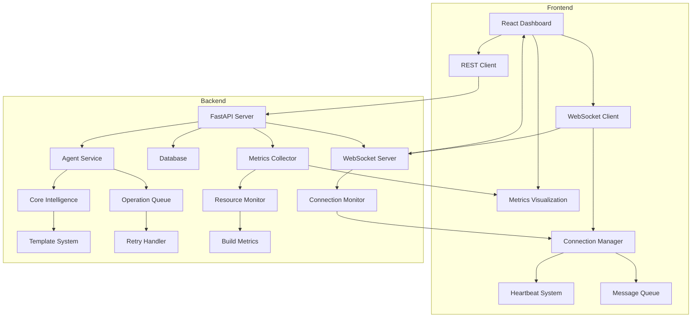

# 🛠️ Technical Guide

## System Architecture

### 🎯 MVP Launch Status

#### Recently Completed
- Enhanced WebSocket stability features:
  * Robust reconnection with exponential backoff
  * Heartbeat mechanism for connection health
  * Message queueing for disconnected state
  * Comprehensive subscription management
- Comprehensive monitoring system:
  * System metrics collection (CPU, Memory, Disk)
  * WebSocket health monitoring
  * Real-time metrics visualization
  * Metrics history management
- Frontend-Backend Integration
  * API proxy configuration for development
  * Type-safe API response handling
  * Real-time update system

#### Current Focus (MVP Launch Priorities)
- Container Stability
  * Resource optimization
  * Build process improvements
  * Performance monitoring
  * Error handling enhancements

### Core Components



### Component Details

#### 1. Core Intelligence (`intelligence.py`)
```python
class CoreIntelligence:
    def _initialize_core_capabilities(self):
        self.capabilities = {
            'project_generation': Capability(...),
            'code_generation': Capability(...),
            'code_analysis': Capability(...)
        }
```

#### 2. Agent Service (`agent_service.py`)
```python
class AgentService:
    VALID_CAPABILITIES = {
        "code_review",
        "testing",
        "development",
        "documentation",
        "deployment"
    }
```

#### 3. Template System
- Base templates for agent generation
- Dynamic capability loading
- Configuration management
- Lifecycle management

## Development Workflow

### 1. Setting Up Development Environment

```bash
# Clone repository
git clone <repository-url>
cd ai-staff-dev-agent

# Install dependencies
python -m pip install -r requirements.txt
cd dashboard/frontend && npm install

# Start services
docker compose up -d
npm run dev
```

### 2. Code Organization

```
ai-staff-dev-agent/
├── backend/
│   ├── app/
│   │   ├── api/          # REST endpoints
│   │   ├── core/         # Core logic
│   │   ├── models/       # Database models
│   │   ├── services/     # Business logic
│   │   └── websockets/   # WebSocket handlers
│   └── alembic/          # Database migrations
├── dashboard/
│   └── frontend/
│       ├── src/
│       │   ├── components/  # React components
│       │   ├── services/    # API clients
│       │   └── types/       # TypeScript types
│       └── tests/
└── private/
    └── config/
        └── templates/     # Agent templates
```

### 3. Development Standards

#### Code Style
- Python: PEP 8
- TypeScript: ESLint + Prettier
- Git commit messages: Conventional Commits

#### Testing
```bash
# Backend tests
pytest tests/

# Frontend tests
cd dashboard/frontend
npm test

# E2E tests
npm run test:e2e
```

#### Performance Monitoring
```typescript
// Frontend performance tracking
const { startMeasure, endMeasure } = usePerformanceMonitor('ComponentName');
startMeasure();
render(<Component />);
endMeasure();
```

#### Build Optimization
```bash
# Enable BuildKit
export DOCKER_BUILDKIT=1

# Clean system before builds
docker system prune -a

# Monitor build
docker stats
```

##### Resource Configuration
```yaml
# docker-compose.yml
services:
  app:
    build:
      context: .
      dockerfile: Dockerfile
    deploy:
      resources:
        limits:
          cpus: '6'
          memory: '12G'
        reservations:
          cpus: '4'
          memory: '8G'
```

##### Build Performance Tips
- Use multi-stage builds
- Implement layer caching
- Optimize context size
- Monitor resource usage
- Set appropriate resource limits

#### WebSocket Stability
```typescript
// Enhanced WebSocket configuration
const ws = useWebSocket({
  reconnectOptions: {
    maxAttempts: 5,
    backoffFactor: 1.5,
    initialDelay: 1000,
    maxDelay: 30000
  },
  heartbeat: {
    interval: 30000,
    timeout: 5000
  },
  queueing: {
    enabled: true,
    maxSize: 1000,
    strategy: 'discard-old'
  }
});

// Connection monitoring
ws.on('metrics', (data) => {
  console.log('Latency:', data.latency);
  console.log('Message throughput:', data.throughput);
  console.log('Connection stability:', data.stability);
});
```

## Database Schema

### Core Tables

#### 1. Agents
```sql
CREATE TABLE agents (
    id UUID PRIMARY KEY,
    name VARCHAR(255),
    capabilities JSONB,
    status VARCHAR(50),
    metadata JSONB
);
```

#### 2. Projects
```sql
CREATE TABLE projects (
    id UUID PRIMARY KEY,
    name VARCHAR(255),
    description TEXT,
    status VARCHAR(50),
    metadata JSONB
);
```

#### 3. Operations
```sql
CREATE TABLE operations (
    id UUID PRIMARY KEY,
    agent_id UUID REFERENCES agents(id),
    project_id UUID REFERENCES projects(id),
    type VARCHAR(100),
    capability VARCHAR(100),
    status VARCHAR(50),
    priority VARCHAR(20),
    progress FLOAT,
    created_at TIMESTAMP,
    started_at TIMESTAMP,
    completed_at TIMESTAMP,
    error TEXT,
    result JSONB,
    metadata JSONB,
    retry_count INTEGER DEFAULT 0,
    last_retry_at TIMESTAMP,
    retry_strategy VARCHAR(50)
);

CREATE TABLE operation_metrics (
    id UUID PRIMARY KEY,
    operation_id UUID REFERENCES operations(id),
    timestamp TIMESTAMP,
    metric_type VARCHAR(50),
    value JSONB,
    metadata JSONB
);
```

## API Reference

### REST Endpoints

#### Agents
```typescript
interface Agent {
  id: string;
  name: string;
  capabilities: string[];
  status: 'active' | 'inactive';
  metadata: Record<string, any>;
}

// GET /api/v1/agents
// POST /api/v1/agents
// GET /api/v1/agents/{agent_id}
// PUT /api/v1/agents/{agent_id}
// DELETE /api/v1/agents/{agent_id}
```

#### Projects
```typescript
interface Project {
  id: string;
  name: string;
  description?: string;
  status: string;
  metadata: Record<string, any>;
}

// GET /api/v1/projects
// POST /api/v1/projects
// GET /api/v1/projects/{project_id}
// PUT /api/v1/projects/{project_id}
// DELETE /api/v1/projects/{project_id}
```

### WebSocket Events

```typescript
interface WebSocketMessage {
  type: 'agent_operation' | 'project_update' | 'capability_execution' | 'metrics_update' | 'queue_status';
  timestamp: string;
  payload: {
    operation?: {
      id: string;
      type: string;
      status: string;
      progress: number;
      result?: any;
      error?: string;
      retry_count?: number;
      retry_strategy?: string;
    };
    metrics?: {
      type: string;
      value: any;
      metadata?: Record<string, any>;
    };
    queue_status?: {
      name: string;
      total_operations: number;
      active_operations: number;
      waiting_operations: number;
      average_wait_time: number;
    };
  };
}
```

## Deployment

### Development
```bash
docker compose up -d
```

### Production
```bash
docker compose -f docker-compose.yml -f docker-compose.prod.yml up -d
```

### Configuration
```bash
# Update agent settings
python private/config/templates/manage_config.py update-agent ExampleAgent

# Validate configuration
python private/config/templates/manage_config.py validate
```

## Monitoring & Debugging

### 1. Logs
```bash
# View service logs
docker compose logs -f

# View specific service
docker compose logs -f agent-service
```

### 2. Metrics
- Grafana dashboard: http://localhost:3000/grafana
- Prometheus metrics: http://localhost:9090

### 3. Performance Monitoring
- Frontend DevTools Performance tab
- WebSocket latency metrics
- Database query performance
- Operation queue metrics
- Agent performance tracking
- Resource utilization monitoring
- Real-time metrics visualization
- Historical performance analysis

## Security Considerations

### 1. Authentication
- JWT-based authentication
- Role-based access control
- API key management

### 2. Data Protection
- Environment variable management
- Secure WebSocket connections
- Database encryption

### 3. Code Security
- Dependency scanning
- Static code analysis
- Regular security updates

## Troubleshooting

### Common Issues

1. Container Build Failures
   - Clean Docker system: `docker system prune -a`
   - Increase resource allocation in Docker Desktop:
     * CPUs: 6+ (minimum 4)
     * Memory: 12GB+ (minimum 8GB)
     * Swap: 4GB+
     * Disk: 100GB+
   - Enable BuildKit: `export DOCKER_BUILDKIT=1`
   - Monitor build with `docker stats`
   - Check network connectivity during large transfers
   - Clear build cache if needed

2. Container Stability Issues
   - Monitor resource usage with `docker stats`
   - Check container logs: `docker compose logs -f`
   - Review resource limits in docker-compose.yml
   - Ensure proper shutdown sequence
   - Monitor system metrics in Grafana

3. Agent Initialization Failures
   - Check configuration in `private/config/agents.yaml`
   - Verify capability requirements
   - Review service logs
   - Monitor resource allocation

4. Database Connection Issues
   - Check connection string
   - Verify migrations
   - Check database logs
   - Monitor connection pool

5. WebSocket Connection Problems
   - Check network connectivity
   - Verify WebSocket URL
   - Review browser console logs
   - Monitor heartbeat mechanism
   - Check reconnection settings

## Best Practices

### 1. Code Quality
- Write comprehensive tests
- Use TypeScript for type safety
- Follow project coding standards
- Document complex logic

### 2. Performance
- Optimize database queries
- Implement caching where appropriate
- Monitor memory usage
- Profile slow operations

### 3. Development Process
- Create feature branches
- Write clear commit messages
- Update documentation
- Review code changes

## Contributing

1. Fork the repository
2. Create a feature branch
3. Make changes
4. Add tests
5. Submit pull request

## Resources

- [Project Documentation](docs/)
- [API Documentation](api-docs/)
- [Contributing Guide](CONTRIBUTING.md)
